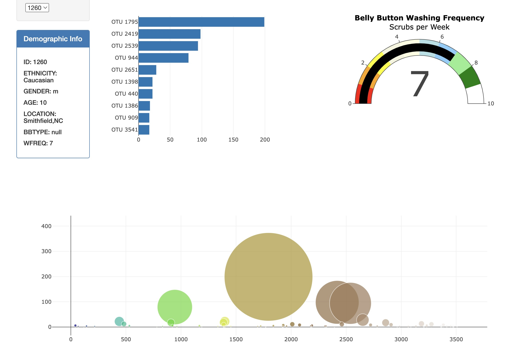
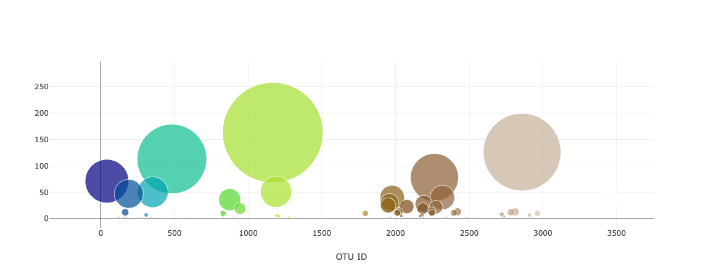

# belly-button-challenge
- Here's the link to my interactive dashboard : https://m0412.github.io/belly-button-challenge/

This project is about building an interactive dashboard to explore the Belly Button Biodiversity dataset, which catalogs the microbes that colonize human navels. The dataset reveals that a small handful of microbial species (also called operational taxonomic units, or OTUs, in the study) were present in more than 70% of people, while the rest were relatively rare.

### The following tasks have been accomplished:
- Use the D3 library to read in samples.json from the URL "https://2u-data-curriculum-team.s3.amazonaws.com/dataviz-classroom/v1.1/14-Interactive-Web-Visualizations/02-Homework/samples.json"
- Create a horizontal bar chart with a dropdown menu to display the top 10 OTUs found in that individual.
    - Use sample_values as the values for the bar chart.
    - Use otu_ids as the labels for the bar chart.
    - Use otu_labels as the hovertext for the chart.
    

- Create a bubble chart that displays each sample.
    - Use otu_ids for the x values.
    - Use sample_values for the y values.
    - Use sample_values for the marker size.
    - Use otu_ids for the marker colors.
    - Use otu_labels for the text values.
    

- Display the sample metadata, i.e., an individual's demographic information.
    - Display each key-value pair from the metadata JSON object somewhere on the page.
    

- Adapt Gauge Chart from the URL "https://plot.ly/javascript/gauge-charts/Links" to plot the weekly washing frequency of the individual.

- Update all the plots when a new sample is selected.
